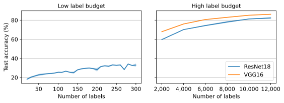

# Wasserstein adversarial active learning (WAAL)

This repo contains code adapted from [`WAAL`](https://github.com/cjshui/WAAL) to help compare with [semi-supervised Bayesian active learning](https://arxiv.org/abs/2404.17249) (see [`epig`](https://github.com/fbickfordsmith/epig)).


## Results

<div align="center">
	
</div>

WAAL's performance on CIFAR-10 data.
The low-label-budget evaluation is comparable to the standard CIFAR-10 evaluation of semi-supervised Bayesian active learning.
The high-label-budget evaluation is a sanity check for comparison with the CIFAR-10 results in the WAAL paper.


## Getting set up

Clone the repo and move into it:

```bash
git clone https://github.com/fbickfordsmith/waal.git && cd waal
```

If you're not using a CUDA device, remove the `cudatoolkit` and `pytorch-cuda` dependencies in `environment.yaml`.

Create a Python environment using [Mamba](https://mamba.readthedocs.io) (or [Conda](https://conda.io), replacing `mamba` with `conda` below):

```bash
mamba env create --file environment.yaml
```


## Reproducing the results

Run active learning:

```bash
for seed in {0..4}; do
    # Setup from the WAAL paper.
    python run_active_learning.py --seed ${seed}

    # ResNet18 instead of VGG16.
    python run_active_learning.py --seed ${seed} --use_resnet True

    # Low-budget setting with ResNet18.
    python run_active_learning.py --seed ${seed} --use_resnet True --n_labels_start 20 --n_labels_end 300 --n_labels_step 10
done
```

Plot the results:

```bash
python plot_results.py
```


## Citing this work

[`WAAL`](https://github.com/cjshui/WAAL) repo and WAAL method:

```bibtex
@article{
    shui2020deep,
    author = {Shui, Changjian and Zhou, Fan and Gagn\'e, Christian and Wang, Boyu},
    year = {2020},
    title = {Deep active learning: unified and principled method for query and training},
    journal = {International Conference on Artificial Intelligence and Statistics},
}
```

This repo:

```bibtex
@article{
    bickfordsmith2024making,
    author = {{Bickford Smith}, Freddie and Foster, Adam and Rainforth, Tom},
    year = {2024},
    title = {Making better use of unlabelled data in {Bayesian} active learning},
    journal = {International Conference on Artificial Intelligence and Statistics},
}
```

([`src/`](/src/) and [`run_active_learning.py`](/run_active_learning.py) in this repo contain code adapted from the original repo.
The remainder of this repo is new.)